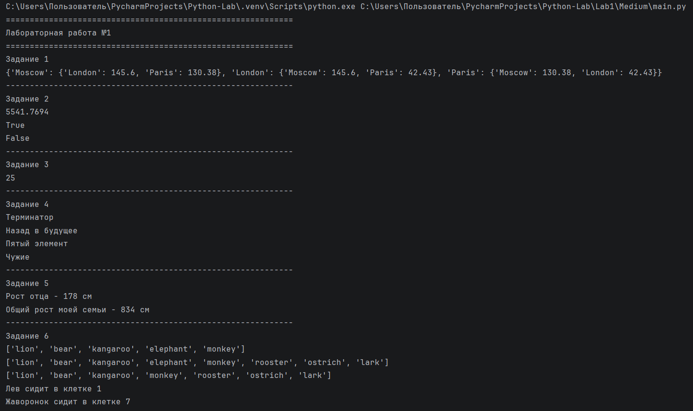
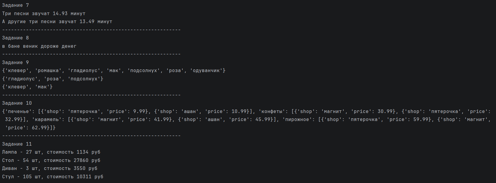

# Отчет по лабораторной работе №1

---

## Задание (Medium)

1. Написать верхнеуровневый модуль, который будет использовать логику из модулей-заданий. Перед этим нужно придумать способ инкапсулировать логику для корректного импортирования.
2. Оформить отчёт в `README.md`.

---

# Описание проделанной работы

В ходе лабораторной работы все задания из лабораторной работы №1 были разделены на отдельные модули. Для каждого задания был создан отдельный файл (task1.py — task11.py).

В каждом модуле логика задания была инкапсулирована в функцию `run()`. Это позволило избежать автоматического выполнения кода при импортировании.

Для корректной организации запуска был создан верхнеуровневый модуль `main.py`, который импортирует все модули и вызывает функции `run()`.

Также в каждом модуле была использована конструкция:

```
if __name__ == '__main__':
    run()
```

Данная конструкция позволяет запускать модуль отдельно или импортировать его без автоматического выполнения кода.

---

# Код решения:

### main.py

```python
import task1
import task2
import task3
import task4
import task5
import task6
import task7
import task8
import task9
import task10
import task11

print('=' * 60)
print('Лабораторная работа №1')
print('=' * 60)

print('Задание 1')
task1.run()

print('-' * 60)

print('Задание 2')
task2.run()

print('-' * 60)

print('Задание 3')
task3.run()

print('-' * 60)

print('Задание 4')
task4.run()

print('-' * 60)

print('Задание 5')
task5.run()

print('-' * 60)

print('Задание 6')
task6.run()

print('-' * 60)

print('Задание 7')
task7.run()

print('-' * 60)

print('Задание 8')
task8.run()

print('-' * 60)

print('Задание 9')
task9.run()

print('-' * 60)

print('Задание 10')
task10.run()

print('-' * 60)

print('Задание 11')
task11.run()
```

### task1.py

```python
import math

def run():
    sites = {
        'Moscow': (550, 370),
        'London': (510, 510),
        'Paris': (480, 480),
    }

    distances = {
        'Moscow': {
            'London': round(
                math.sqrt(
                    (sites['Moscow'][0] - sites['London'][0]) ** 2 +
                    (sites['Moscow'][1] - sites['London'][1]) ** 2
                ),
                2
            ),
            'Paris': round(
                math.sqrt(
                    (sites['Moscow'][0] - sites['Paris'][0]) ** 2 +
                    (sites['Moscow'][1] - sites['Paris'][1]) ** 2
                ),
                2
            )
        },

        'London': {
            'Moscow': round(
                math.sqrt(
                    (sites['London'][0] - sites['Moscow'][0]) ** 2 +
                    (sites['London'][1] - sites['Moscow'][1]) ** 2
                ),
                2
            ),
            'Paris': round(
                math.sqrt(
                    (sites['London'][0] - sites['Paris'][0]) ** 2 +
                    (sites['London'][1] - sites['Paris'][1]) ** 2
                ),
                2
            )
        },

        'Paris': {
            'Moscow': round(
                math.sqrt(
                    (sites['Paris'][0] - sites['Moscow'][0]) ** 2 +
                    (sites['Paris'][1] - sites['Moscow'][1]) ** 2
                ),
                2
            ),
            'London': round(
                math.sqrt(
                    (sites['Paris'][0] - sites['London'][0]) ** 2 +
                    (sites['Paris'][1] - sites['London'][1]) ** 2
                ),
                2
            )
        }
    }

    print(distances)

if __name__ == '__main__':
    run()
```

### task2.py

```python
import math

def run():
    radius = 42

    area = round(math.pi * radius ** 2, 4)

    print(area)

    point_1 = (23, 34)
    point_2 = (30, 30)

    d1 = math.sqrt(point_1[0] ** 2 + point_1[1] ** 2)
    d2 = math.sqrt(point_2[0] ** 2 + point_2[1] ** 2)

    print(d1 <= radius)
    print(d2 <= radius)

if __name__ == '__main__':
    run()
```

### task3.py

```python
def run():
    result = 1 * 2 + 3 + 4 * 5

    print(result)

if __name__ == '__main__':
    run()
```

### task4.py

```python
def run():
    my_favorite_movies = 'Терминатор, Пятый элемент, Аватар, Чужие, Назад в будущее'

    print(my_favorite_movies[:10])
    print(my_favorite_movies[42:63])
    print(my_favorite_movies[12:25])
    print(my_favorite_movies[35:40])

if __name__ == '__main__':
    run()
```

### task5.py

```python
def run():
    my_family = ['Раис', 'Эльвира', 'Эвелина', 'Кашиф', 'Фамия']

    my_family_height = [
        ['Раис', 178],
        ['Эльвира', 162],
        ['Эвелина', 158],
        ['Кашиф', 182],
        ['Фамия', 154]
    ]

    print(f'Рост отца - {my_family_height[0][1]} см')

    total_height = 0
    for person in my_family_height:
        total_height += person[1]

    print(f'Общий рост моей семьи - {total_height} см')

if __name__ == '__main__':
    run()
```

### task6.py

```python
def run():
    zoo = ['lion', 'kangaroo', 'elephant', 'monkey']

    zoo.insert(1, 'bear')
    print(zoo)

    birds = ['rooster', 'ostrich', 'lark']

    zoo.extend(birds)
    print(zoo)

    zoo.remove('elephant')
    print(zoo)

    print(f'Лев сидит в клетке {zoo.index("lion") + 1}')
    print(f'Жаворонок сидит в клетке {zoo.index("lark") + 1}')

if __name__ == '__main__':
    run()
```

### task7.py

```python
def run():
    violator_songs_list = [
        ['World in My Eyes', 4.86],
        ['Sweetest Perfection', 4.43],
        ['Personal Jesus', 4.56],
        ['Halo', 4.9],
        ['Waiting for the Night', 6.07],
        ['Enjoy the Silence', 4.20],
        ['Policy of Truth', 4.76],
        ['Blue Dress', 4.29],
        ['Clean', 5.83],
    ]

    song_time = round(violator_songs_list[3][1] + violator_songs_list[5][1] + violator_songs_list[8][1], 2)
    print(f'Три песни звучат {song_time} минут')

    violator_songs_dict = {
        'World in My Eyes': 4.76,
        'Sweetest Perfection': 4.43,
        'Personal Jesus': 4.56,
        'Halo': 4.30,
        'Waiting for the Night': 6.07,
        'Enjoy the Silence': 4.6,
        'Policy of Truth': 4.88,
        'Blue Dress': 4.18,
        'Clean': 5.68,
    }

    song_time1 = round(
        violator_songs_dict['Sweetest Perfection'] + violator_songs_dict['Policy of Truth'] + violator_songs_dict[
            'Blue Dress'], 2)
    print(f'А другие три песни звучат {song_time1} минут')

if __name__ == '__main__':
    run()
```

### task8.py

```python
def run():
    secret_message = [
        'квевтфпп6щ3стмзалтнмаршгб5длгуча',
        'дьсеы6лц2бане4т64ь4б3ущея6втщл6б',
        'т3пплвце1н3и2кд4лы12чф1ап3бкычаь',
        'ьд5фму3ежородт9г686буиимыкучшсал',
        'бсц59мегщ2лятьаьгенедыв9фк9ехб1а',
    ]

    first_word = secret_message[0][3]
    second_letter = secret_message[1][9:13]
    third_letter = secret_message[2][5:15:2]
    fourth_letter = secret_message[3][12:6:-1]
    fifth_letter = secret_message[4][20:15:-1]

    secret_message = f'{first_word} {second_letter} {third_letter} {fourth_letter} {fifth_letter}'
    print(secret_message)

if __name__ == '__main__':
    run()
```

### task9.py

```python
def run():
    garden = ('ромашка', 'роза', 'одуванчик', 'ромашка', 'гладиолус', 'подсолнух', 'роза',)
    meadow = ('клевер', 'одуванчик', 'ромашка', 'клевер', 'мак', 'одуванчик', 'ромашка',)

    garden_set = set(garden)
    meadow_set = set(meadow)

    flower_set = set.union(garden_set, meadow_set)
    print(flower_set)

    flower_set = set(garden_set - meadow_set)
    print(flower_set)

    flower_set = set(meadow_set - garden_set)
    print(flower_set)

if __name__ == '__main__':
    run()
```

### task10.py

```python
def run():
    shops = {
        'ашан': [
            {'name': 'печенье', 'price': 10.99},
            {'name': 'конфеты', 'price': 34.99},
            {'name': 'карамель', 'price': 45.99},
            {'name': 'пирожное', 'price': 67.99}
        ],
        'пятерочка': [
            {'name': 'печенье', 'price': 9.99},
            {'name': 'конфеты', 'price': 32.99},
            {'name': 'карамель', 'price': 46.99},
            {'name': 'пирожное', 'price': 59.99}
        ],
        'магнит': [
            {'name': 'печенье', 'price': 11.99},
            {'name': 'конфеты', 'price': 30.99},
            {'name': 'карамель', 'price': 41.99},
            {'name': 'пирожное', 'price': 62.99}
        ],
    }

    sweets = {
        'печенье': [
            {'shop': 'пятерочка', 'price': 9.99},
            {'shop': 'ашан', 'price': 10.99}
        ],
        'конфеты': [
            {'shop': 'магнит', 'price': 30.99},
            {'shop': 'пятерочка', 'price': 32.99}
        ],
        'карамель': [
            {'shop': 'магнит', 'price': 41.99},
            {'shop': 'ашан', 'price': 45.99}
        ],
        'пирожное': [
            {'shop': 'пятерочка', 'price': 59.99},
            {'shop': 'магнит', 'price': 62.99}
        ],
    }

    print(sweets)

if __name__ == '__main__':
    run()
```

### task11.py

```python
def run():
    goods = {
        'Лампа': '12345',
        'Стол': '23456',
        'Диван': '34567',
        'Стул': '45678',
    }
    store = {
        '12345': [
            {'quantity': 27, 'price': 42},
        ],
        '23456': [
            {'quantity': 22, 'price': 510},
            {'quantity': 32, 'price': 520},
        ],
        '34567': [
            {'quantity': 2, 'price': 1200},
            {'quantity': 1, 'price': 1150},
        ],
        '45678': [
            {'quantity': 50, 'price': 100},
            {'quantity': 12, 'price': 95},
            {'quantity': 43, 'price': 97},
        ],
    }
    lamp_code = goods['Лампа']
    lamps_item = store[lamp_code][0]
    lamps_quantity = lamps_item['quantity']
    lamps_price = lamps_item['price']
    lamps_cost = lamps_quantity * lamps_price
    print('Лампа -', lamps_quantity, 'шт, стоимость', lamps_cost, 'руб')

    table_code = goods['Стол']
    table_item1 = store[table_code][0]
    table_item2 = store[table_code][1]
    table_quantity = table_item1['quantity'] + table_item2['quantity']
    table_price1 = table_item1['price']
    table_price2 = table_item2['price']
    table_cost = table_item1['quantity'] * table_price1 + table_item2['quantity'] * table_price2
    print('Стол -', table_quantity, 'шт, стоимость', table_cost, 'руб')

    sofa_code = goods['Диван']
    sofa_item1 = store[sofa_code][0]
    sofa_item2 = store[sofa_code][1]
    sofa_quantity = sofa_item1['quantity'] + sofa_item2['quantity']
    sofa_price1 = sofa_item1['price']
    sofa_price2 = sofa_item2['price']
    sofa_cost = sofa_item1['quantity'] * sofa_price1 + sofa_price2 * sofa_item2['quantity']
    print('Диван -', sofa_quantity, 'шт, стоимость', sofa_cost, 'руб')

    chair_code = goods['Стул']
    chair_item1 = store[chair_code][0]
    chair_item2 = store[chair_code][1]
    chair_item3 = store[chair_code][2]
    chair_quantity = chair_item1['quantity'] + chair_item2['quantity'] + chair_item3['quantity']
    chair_price1 = chair_item1['price']
    chair_price2 = chair_item2['price']
    chair_price3 = chair_item3['price']
    chair_cost = chair_item1['quantity'] * chair_price1 + chair_item2['quantity'] * chair_price2 + chair_item3[
        'quantity'] * chair_price3

    print('Стул -', chair_quantity, 'шт, стоимость', chair_cost, 'руб')

if __name__ == '__main__':
    run()
```

---

# Скриншоты результатов





---

# Список использованных источников:

1. [Лабораторная работа №1](https://evil-teacher.orbiter.website/prog_pm/lab01/).
2. [Учебное пособие по Python](https://docs.python.org/3/tutorial/).
3. [FAQ по курсу “Пайтон с нуля”](https://docs.google.com/document/d/1r4uqIEtQFG6JAGAX5YYOj8DCA55aI4b3iXtJNrENweU/edit?tab=t.0#heading=h.c40rgxxylne).