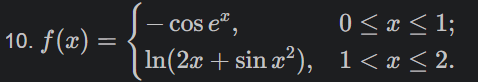
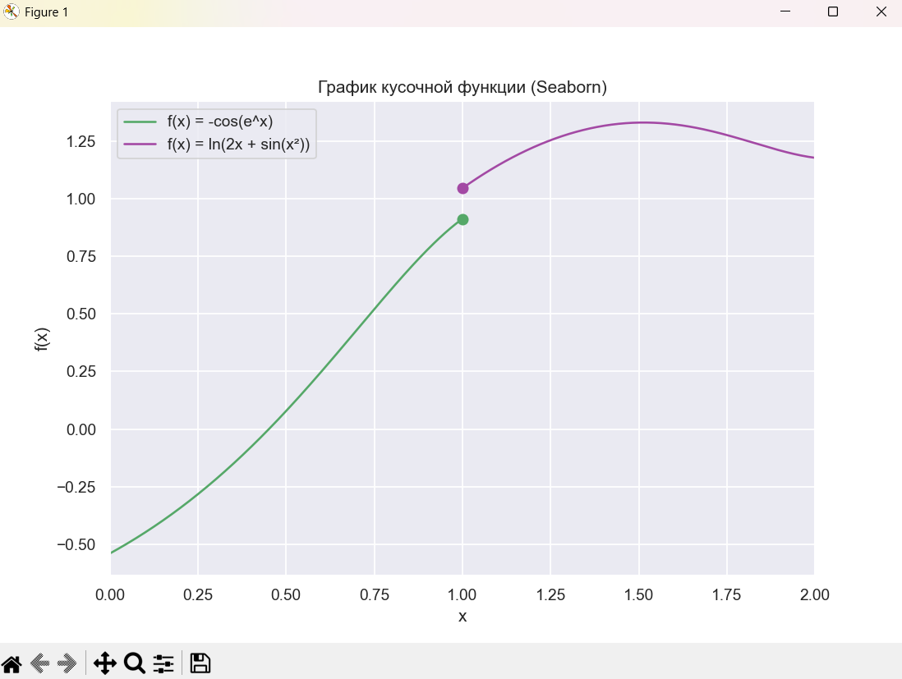

# Отчет по лабораторной работе №2

---

## Задание (Medium)

Построить график кусочной функции:



Использовать библиотеку `seaborn` вместо `matplotlib`.

# Описание проделанной работы

## 1. Индивидуальное задание (Вариант 10)

### 1.1. Постановка задачи

Необходимо построить график кусочной функции с использованием библиотеки `seaborn`, заменив стандартные средства `matplotlib`.

### 1.2. Программа

```python
import numpy as np
import seaborn as sns
import matplotlib.pyplot as plt
import pandas as pd

# Устанавливаем стиль графиков seaborn (темная сетка)
sns.set_theme(style = "darkgrid")

# 1 часть функции: 0 ≤ x ≤ 1
x1 = np.linspace(0, 1, 200)  # создаем 200 точек на отрезке [0, 1]
y1 = -np.cos(np.exp(x1))     # вычисляем значения функции y = -cos(e^x)

# 2 часть функции: 1 < x ≤ 2
x2 = np.linspace(1.001, 2, 200)  # начинаем с 1.001, чтобы не было "склейки" графиков
y2 = np.log(2 * x2 + np.sin(x2 ** 2))  # вычисляем значения функции y = ln(2x + sin(x²))

# Создаем DataFrame для удобной передачи данных в seaborn
df1 = pd.DataFrame({"x": x1, "y": y1})
df2 = pd.DataFrame({"x": x2, "y": y2})

# Создаем область для построения графика
plt.figure(figsize = (10, 6))

# Строим первую часть функции (зеленый цвет)
sns.lineplot(data = df1, x = "x", y = "y",
             color = 'g',
             label = "f(x) = -cos(e^x)")

# Строим вторую часть функции (фиолетовый цвет)
sns.lineplot(data = df2, x = "x", y = "y",
             color = '#A349A4',
             label = "f(x) = ln(2x + sin(x²))")

# Отображение точек при x = 1
y_left = -np.cos(np.exp(1))
y_right = np.log(2 * 1 + np.sin(1))

# Отображаем точки разрыва
plt.scatter(1, y_left, color = 'g', s = 50)
plt.scatter(1, y_right, color = '#A349A4', s = 50)

# Оформление графика
plt.title('График кусочной функции (Seaborn)')  # заголовок
plt.xlabel('x')  # подпись оси X
plt.ylabel('f(x)')  # подпись оси Y
plt.xlim(0, 2)  # ограничение диапазона по оси X
plt.legend()  # отображение легенды

# Отображаем график
plt.show()
```

### 1.3. Результат работы программы



---

# Список использованных источников:

1. [Лабораторная работа №2](https://evil-teacher.orbiter.website/prog_pm/lab02/).
2. [Seaborn](https://seaborn.pydata.org/)