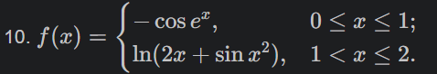
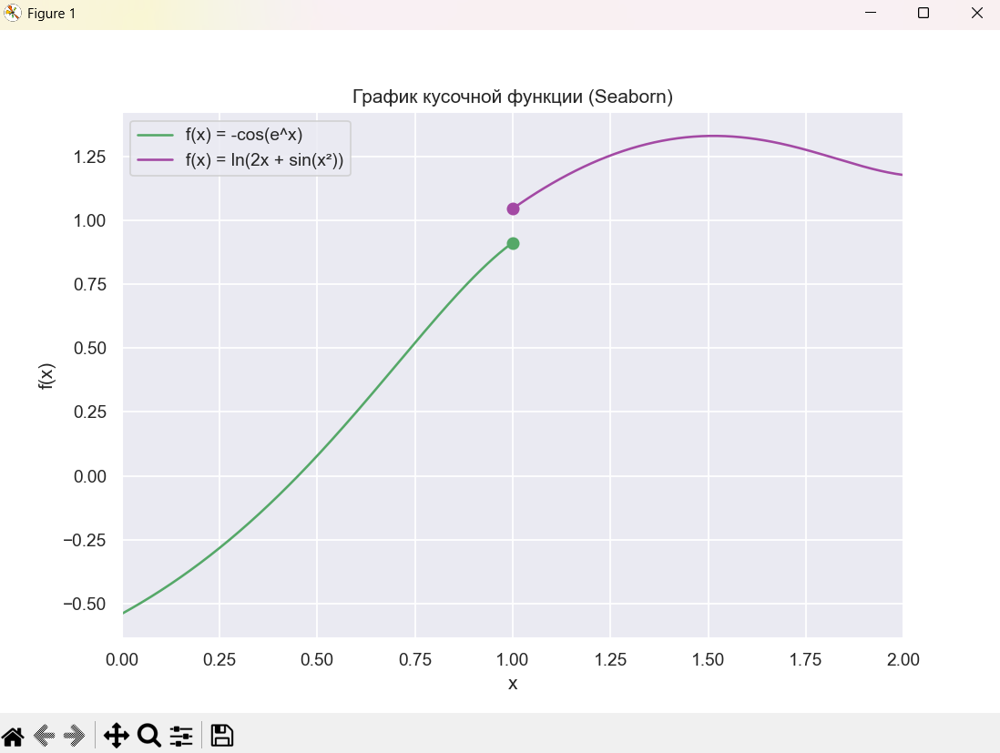

# Отчет по лабораторной работе №2

---

## Задание (Medium)

Построить график кусочной функции:



Использовать библиотеку `seaborn` вместо `matplotlib`.

# Описание проделанной работы

## 1. Индивидуальное задание (Вариант 10)

### 1.1. Постановка задачи

Необходимо построить график кусочной функции с использованием библиотеки `seaborn`, заменив стандартные средства `matplotlib`.

### 1.2. Программа

```python
import numpy as np
import seaborn as sns
import matplotlib.pyplot as plt

# Установка стиля графика
sns.set_theme(style="darkgrid")

# Первая часть функции: y = -cos(e^x)
x1 = np.linspace(0, 1, 200)
y1 = -np.cos(np.exp(x1))

# Вторая часть функции: y = ln(2x + sin(x²))
x2 = np.linspace(1.001, 2, 200)
y2 = np.log(2 * x2 + np.sin(x2 ** 2))

# Создание окна графика
plt.figure(figsize=(10, 6))

# Построение первой части графика
sns.lineplot(
    x=x1,
    y=y1,
    color='g',
    label="f(x) = -cos(e^x)"
)

# Построение второй части графика
sns.lineplot(
    x=x2,
    y=y2,
    color='#A349A4',
    label="f(x) = ln(2x + sin(x²))"
)

# Значения функции при x = 1
y_left = -np.cos(np.exp(1))
y_right = np.log(2 * 1 + np.sin(1))

plt.scatter(1, y_left, color='g', s=50)  # Левая точка
plt.scatter(1, y_right, color='#A349A4', s=50)  # Правая точка

plt.title('График кусочной функции (Seaborn)')
plt.xlabel('x')
plt.ylabel('f(x)')
plt.xlim(0, 2)  # Ограничение оси X
plt.legend()  # Легенда

plt.show()  # Отображение графика
```

### 1.3. Результат работы программы



---

# Список использованных источников:

1. [Лабораторная работа №2](https://evil-teacher.orbiter.website/prog_pm/lab02/).
2. [Seaborn](https://seaborn.pydata.org/)