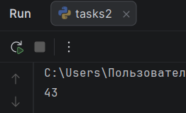

# Отчет по лабораторной работе №3

---

## Задание (Rare)

1. Написать программу для решения задач Вариант 4.
2. Оформить отчёт в README.md.

---
# Условия задач

## Задача №1

Настя составляет 6-буквенные коды из букв Н, А, С, Т, Я. Каждая допустимая гласная буква (А, Я) может входить в код не более одного раза. Сколько кодов может составить Настя?

## Задача №2

Значение арифметического выражения $16^{18} * 4^{10} - 46 - 16$ записали в системе счисления с основанием 4. Сколько цифр 3 содержится в этой записи?

## Задача №3

Пусть M — сумма минимального и максимального натуральных делителей целого числа, не считая единицы и самого числа. Если таких делителей у числа нет, то считаем значение M равным нулю.

Напишите программу, которая перебирает целые числа, большие 452021, в порядке возрастания и ищет среди них такие, для которых значение M при делении на 7 даёт в остатке 3. Вывести первые 5 найденных чисел и соответствующие им значения M.

Формат вывода: для каждого из 5 таких найденных чисел в отдельной строке сначала выводится само число, затем — значение М. Строки выводятся в порядке возрастания найденных чисел.

---

# Описание проделанной работы 

## Задача №1

Для решения задачи был использован метод перебора всех возможных комбинаций длиной 6 из 5 букв.
В коде используется библиотека `itertools` (функция `product`), которая генерирует все возможные кортежи длиной 6 из заданных символов.
Затем проверяется условие, что количество вхождений гласных 'А' и 'Я' не превышает 1 для каждой из них. Счётчик увеличивается при выполнении этого условия.

## Код решения:

```python
from itertools import product

def count_codes():
    letters = ['Н', 'А', 'С', 'Т', 'Я']
    count = 0
    for letter in product(letters, repeat=6):
        if letter.count('А') <= 1 and letter.count('Я') <= 1:
            count += 1
    return count

result = count_codes()
print(result)
```
## Задача №2

Сначала вычисляется значение арифметического выражения на Python. Затем число переводится в четверичную систему счисления путем последовательного деления на 4 с подсчетом остатков, равных 3.

## Код решения:

```python
s = 16**18 * 4**10 - 46 - 16

def count_digits_3():
    count = 0
    n = s
    while n > 0:
        if n % 4 == 3:
            count += 1
        n = n // 4
    return count

result = count_digits_3()
print(result)
```

## Задача №3

Для чисел, начиная с 452022 (строго больше 452021), производится поиск всех делителей (кроме 1 и самого числа). Если делителей найдено не менее двух, то минимальный и максимальный из них складываются. Затем проверяется условие: остаток от деления этой суммы на 7 равен 3. Выводятся первые 5 таких чисел.

## Код решения:

```python
def find_numbers():
    found_numbers = []
    count = 0
    for n in range(452022, 1000000):
        div = []
        for j in range(2,n):
            if n % j == 0:
                div.append(j)
                if len(div) >= 2:
                    m = div[0] + div[-1]
        if m % 7 == 3:
            count += 1
            found_numbers.append((n , m))
        if count == 5:
            break
    return found_numbers

result = find_numbers()
for n, m in result:
    print(n, m)
```

---

# Скриншоты результатов

## Результат задачи №1


## Результат задачи №2



## Результат задачи №3


---

# Список использованных источников:

1. [Лабораторная работа №3](https://evil-teacher.orbiter.website/prog_pm/lab03/)
2. [Itertools в Python - Хабр](https://habr.com/ru/companies/otus/articles/529356/)
3. [itertools — Functions creating iterators for efficient looping](https://docs.python.org/3/library/itertools.html)
4. [Итерируем правильно: 20 приемов использования в Python модуля itertools](https://proglib.io/p/iteriruemsya-pravilno-20-priemov-ispolzovaniya-v-python-modulya-itertools-2020-01-03)


