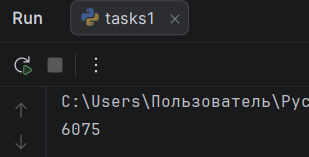
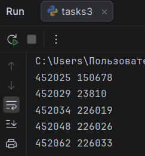

# Отчет по лабораторной работе №3

---

## Задание (Rare). Вариант 4

1. Написать программу для решения задач соответствующего варианта.
2. Оформить отчёт в README.md.

---
## Требования и ограничения

Решения задач оформить в виде функций, возвращающих ответы. Для решения первой задачи использовать `itertools`.

---

# Условия задач

## Задача №1

Настя составляет 6-буквенные коды из букв Н, А, С, Т, Я. Каждая допустимая гласная буква (А, Я) может входить в код не более одного раза. Сколько кодов может составить Настя?

## Задача №2

Значение арифметического выражения $16^{18} * 4^{10} - 46 - 16$ записали в системе счисления с основанием 4. Сколько цифр 3 содержится в этой записи?

## Задача №3

Пусть M — сумма минимального и максимального натуральных делителей целого числа, не считая единицы и самого числа. Если таких делителей у числа нет, то считаем значение M равным нулю.

Напишите программу, которая перебирает целые числа, большие 452021, в порядке возрастания и ищет среди них такие, для которых значение M при делении на 7 даёт в остатке 3. Вывести первые 5 найденных чисел и соответствующие им значения M.

Формат вывода: для каждого из 5 таких найденных чисел в отдельной строке сначала выводится само число, затем — значение М. Строки выводятся в порядке возрастания найденных чисел.

---

# Описание проделанной работы 

## Задача №1

Для решения задачи был использован метод перебора всех возможных комбинаций длиной 6 из 5 букв.
В коде используется библиотека `itertools` (функция `product`), которая генерирует все возможные кортежи длиной 6 из заданных символов.
Затем проверяется условие, что количество вхождений гласных 'А' и 'Я' не превышает 1 для каждой из них. Счётчик увеличивается при выполнении этого условия.

## Код решения:

```python
from itertools import product

def task1():
    letters = ['Н', 'А', 'С', 'Т', 'Я']
    count = 0
    for letter in product(letters, repeat = 6):
        if letter.count('А') <= 1 and letter.count('Я') <= 1:
            count += 1
    return count

result = task1()
print(result)
```
## Задача №2

Сначала вычисляется значение арифметического выражения на Python. Затем число переводится в четверичную систему счисления путем последовательного деления на 4 с подсчетом остатков, равных 3.

## Код решения:

```python
def task2():
    n = 16 ** 18 * 4 ** 10 - 46 - 16

    count = 0
    while n > 0:
        if n % 4 == 3:
            count += 1
        n = n // 4
    return count

result = task2()
print(result)
```

## Задача №3

Для чисел, начиная с 452022 (строго больше 452021), производится перебор. Для каждого числа находится список всех делителей (кроме 1 и самого числа). Делители ищутся перебором чисел от 2 до n−1. Если делители найдены (их хотя бы один), то определяется минимальный и максимальный из них, после чего вычисляется их сумма:
`M = min + max`.

Далее проверяется условие: остаток от деления M на 7 равен 3. Если условие выполняется, число и значение M сохраняются. Поиск продолжается до тех пор, пока не будет найдено 5 таких чисел. После этого работа программы прекращается.

## Код решения:

```python
def task3():
    result = []
    n = 452022

    while len(result) < 5:
        div = []
        for j in range(2, n):
            if n % j == 0:
                div.append(j)
        if len(div) > 0:
            m = min(div) + max(div)
            if m % 7 == 3:
                result.append((n, m))
        n += 1
    return result

res = task3()
for n, m in res:
    print(n, m)
```

---

# Скриншоты результатов

## Результат задачи №1



## Результат задачи №2


## Результат задачи №3



---

# Список использованных источников:

1. [Лабораторная работа №3](https://evil-teacher.orbiter.website/prog_pm/lab03/).
2. [Itertools в Python - Хабр](https://habr.com/ru/companies/otus/articles/529356/).
3. [itertools — Functions creating iterators for efficient looping](https://docs.python.org/3/library/itertools.html).
4. [Итерируем правильно: 20 приемов использования в Python модуля itertools](https://proglib.io/p/iteriruemsya-pravilno-20-priemov-ispolzovaniya-v-python-modulya-itertools-2020-01-03).


