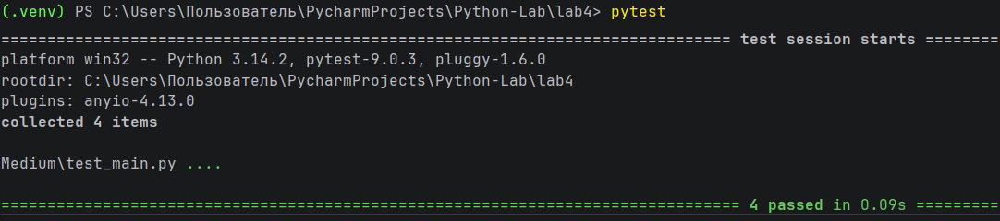

# Отчет по лабораторной работе №4

---

## Задание (Medium). Вариант 4

1. Написать две функции для решения задач своего варианта — с использованием рекурсии и без неё.
2. Написать тесты для реализованных функций с использованием `pytest`.
3. Оформить отчёт в `README.md`.

## Требования и ограничения

Не использовать глобальные переменные и другие средства хранения состояния между вызовами функций.

---

# Условия задач

## Задача №1

Функция для преобразования вложенных списков в строку:
```
>>> to_str([1, [2, [3, [4, [5]]]]])
'1 -> 2 -> 3 -> 4 -> 5 -> None'
```

## Задача №2

Функция для расчёта $a_i = a_{i-2} + \frac{a_{i-1}}{2^{i-1}} \cdot a_0 = a_1 = 1.$

---

# Тестирование программы

Для проверки корректности работы функций были написаны тесты с использованием библиотеки `pytest`.

## Файл с тестами

```python
from main import (
    to_str_recursive,
    to_str_iterative,
    a_recursive,
    a_iterative
)

def test_to_str_recursive():
    x = [1, [2, [3, [4, [5]]]]]
    expected = "1 -> 2 -> 3 -> 4 -> 5 -> None" # Ожидаемый результат

    assert to_str_recursive(x) == expected # Проверка результата функции

def test_to_str_iterative():
    x = [1, [2, [3, [4, [5]]]]]
    expected = "1 -> 2 -> 3 -> 4 -> 5 -> None" # Ожидаемый результат

    assert to_str_iterative(x) == expected # Проверка результата функции

def test_a_recursive():
    assert round(a_recursive(5), 10) == round(1.4794921875, 10) # Сравнение результата с ожидаемым значением

def test_a_iterative():
    assert round(a_iterative(5), 10) == round(1.4794921875, 10) # Сравнение результата с ожидаемым значением
```

---

# Скриншоты результатов



---

# Список использованных источников

1. [Лабораторная работа №4](https://evil-teacher.orbiter.website/prog_pm/lab04/).
2. [pytest: helps you write better programs](https://docs.pytest.org/en/stable/).