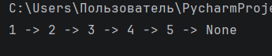
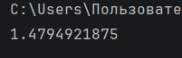

# Отчет по лабораторной работе №4

---

## Задание (Rare). Вариант 4

1. Написать две функции для решения задач своего варианта - с использованием рекурсии и без.
2. Оформить отчёт в README.md.

## Требования и ограничения

Не использовать глобальные переменные и прочие средства хранения состояния между вызовами.

---

# Условия задач

## Задача №1

Функция для преобразования вложенных списков в строку:
```
>>> to_str([1, [2, [3, [4, [5]]]]])
'1 -> 2 -> 3 -> 4 -> 5 -> None'
```

## Задача №2

Функция для расчёта $a_i = a_{i-2} + \frac{a_{i-1}}{2^{i-1}} \cdot a_0 = a_1 = 1.$

---

# Описание проделанной работы 

## Задача 1

Была реализована функция `to_str`, которая преобразует вложенный список в строку вида: `1 -> 2 -> 3 -> 4 -> 5 -> None`.

## Рекурсивное решение

Рекурсивный подход основан на разбиении задачи на более простые подзадачи. Для каждого элемента списка функция вызывает саму себя для обработки текущего значения и оставшейся части списка.

Были выделены базовые случаи:
- если элемент не является списком — он преобразуется в строку;
- если список содержит один элемент — это конец структуры, к результату добавляется `None`.

Таким образом, происходит последовательный обход всей вложенной структуры до достижения конечного элемента.

### Код решения:

```python
def to_str(x):
    # Если это не список (число)
    if not isinstance(x, list):
        return str(x) + " -> "

    # Если в списке только один элемент (конец)
    if len(x) == 1:
        return str(x[0]) + " -> None"

    # Обычный случай
    return to_str(x[0]) + to_str(x[1])

# Проверка
print(to_str([1, [2, [3, [4, [5]]]]]))
```

## Итеративное решение (без рекурсии)

Во втором варианте решение реализовано с помощью цикла `while`. Вместо рекурсивных вызовов используется переменная, которая последовательно проходит по вложенной структуре.

На каждом шаге:

- извлекается текущий элемент;
- добавляется в результирующую строку;
- происходит переход к следующему элементу списка.

Цикл завершается, когда достигается последний элемент.

## Код решения:

```python
def to_str(x):
    s = "" # результат
    # Пока это список
    while isinstance(x, list):
        # Если остался один элемент (конец)
        if len(x) == 1:
            s += str(x[0]) + " -> None"
            return s
        # Добавляем текущий элемент
        s += str(x[0]) + " -> "
        # Переходим к следующему
        x = x[1]
    return s

print(to_str([1, [2, [3, [4, [5]]]]]))
```

---

## Задача 2

Реализована функция для вычисления последовательности: $a_i = a_{i-2} + \frac{a_{i-1}}{2^{i-1}} \cdot a_0 = a_1 = 1.$

## Рекурсивное решение

В рекурсивном варианте функция вызывает саму себя для вычисления предыдущих элементов последовательности. Были заданы базовые случаи ($a_0$ и $a_1$), при достижении которых рекурсия прекращается.

## Код решения:

```python
def a(n):
    # База
    if n == 0 or n == 1:
        return 1

    # Формула
    return a(n - 2) + a(n - 1) / (2 ** (n - 1))

# Проверка
print(a(5))
```

## Итеративное решение (без рекурсии)

Итеративный подход позволяет избежать повторных вычислений, характерных для рекурсии. Для этого используются переменные, хранящие два предыдущих значения последовательности.

Код решения:

```python
def a(n):
    # Базовые случаи
    if n == 0 or n == 1:
        return 1

    # Начальные значения
    a0 = 1
    a1 = 1

    # Считаем последовательно
    for i in range(2, n + 1):
        ai = a0 + a1 / (2 ** (i - 1))
        a0 = a1
        a1 = ai

    return a1

# Проверка
print(a(5))
```

---

# Скриншоты результатов

## Результат задачи №1 (Рекурсивное и итеративное)



## Результат задачи №2 (Рекурсивное и итеративное)



---

# Список использованных источников:

1. [Лабораторная работа №4](https://evil-teacher.orbiter.website/prog_pm/lab04/)
2. [Recursion in Programming - Full Course](https://www.youtube.com/watch?v=IJDJ0kBx2LM)
3. [Самоучитель по Python для начинающих. Часть 13: Рекурсивные функции](https://proglib.io/p/samouchitel-po-python-dlya-nachinayushchih-chast-13-rekursivnye-funkcii-2023-01-23)
4. [Как работает рекурсия – объяснение в блок-схемах и видео](https://habr.com/ru/articles/337030/)