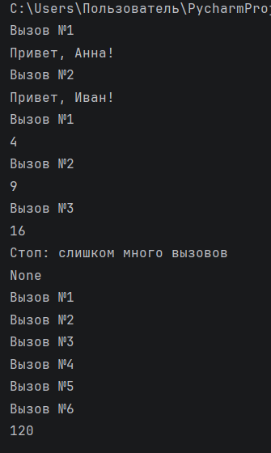

# Отчет по лабораторной работе №5

---

## Задание (Medium). Вариант 4

1. Реализовать замыкание.
2. Написать декоратор.
3. Применить декоратор к замыканию.
4. Создать декоратор с опциональным параметром.
5. Обеспечить поддержку рекурсивных функций.
6. Оформить отчёт в `README.md`.

---

# Условия задач

## Задача №1

Реализовать замыкание, отбирающее только уникальные значения из переданных данных.

## Задача №2

Реализовать декоратор, ограничивающий количество вызовов функции.

## Задача №3

Создать декоратор с опциональным параметром и проверить его работу с рекурсивной функцией.

---

# Описание проделанной работы

В ходе выполнения лабораторной работы были изучены:
- замыкания;
- декораторы;
- использование `nonlocal`;
- рекурсивные функции;
- декораторы с параметрами.

Был реализован декоратор `limit_calls`, который:
- может использоваться с параметром и без него;
- ограничивает количество вызовов функции;
- поддерживает работу рекурсивных функций.

Также было реализовано замыкание для получения только уникальных значений.

---

# Код решения

``` python
# Декоратор с опциональным параметром
def limit_calls(max_calls=None):

    # Если декоратор используется без параметров
    if callable(max_calls):

        # Сохраняем функцию
        func = max_calls

        # Счётчик вызовов
        count = 0

        # Обёртка для функции
        def wrapper(*args, **kwargs):

            nonlocal count

            # Увеличиваем количество вызовов
            count += 1

            print(f"Вызов №{count}")

            # Вызываем исходную функцию
            return func(*args, **kwargs)

        return wrapper

    # Если декоратор используется с параметром
    def decorator(func):

        # Счётчик вызовов
        count = 0

        # Обёртка для функции
        def wrapper(*args, **kwargs):

            nonlocal count

            # Проверка лимита вызовов
            if count >= max_calls:

                print("Стоп: слишком много вызовов")

                return None

            # Увеличиваем счётчик
            count += 1

            print(f"Вызов №{count}")

            # Вызываем функцию
            return func(*args, **kwargs)

        return wrapper

    return decorator

# Использование декоратора без параметров
@limit_calls
def hello(name):

    print(f"Привет, {name}!")

# Проверка работы функции
hello("Анна")
hello("Иван")

# Использование декоратора с параметром
@limit_calls(3)
def square(x):

    return x * x

# Проверка работы функции
print(square(2))
print(square(3))
print(square(4))
print(square(5))

# Рекурсивная функция
@limit_calls(10)
def factorial(n):

    # Базовый случай
    if n == 0:
        return 1

    # Рекурсивный вызов
    return n * factorial(n - 1)

# Проверка работы рекурсии
print(factorial(5))
```

---

# Объяснение работы программы

## Декоратор без параметров

Декоратор может использоваться без аргументов:

```python
@limit_calls
```

В этом случае он только считает количество вызовов функции.

---

## Декоратор с параметром

Также декоратор поддерживает передачу ограничения:

```python
@limit_calls(3)
```

После превышения лимита выводится сообщение:

```text
Стоп: слишком много вызовов
```

---

## Поддержка рекурсии

Декоратор был протестирован на рекурсивной функции `factorial`.

Каждый рекурсивный вызов учитывается в общем счётчике вызовов функции.

---

# Скриншоты результатов



---

# Список использованных источников:

1. [Лабораторная работа №5](https://evil-teacher.orbiter.website/prog_pm/lab05/).
2. [Python Docs — Defining Functions](https://docs.python.org/3/tutorial/controlflow.html#defining-functions).
3. [Habr — Декораторы в Python: простое объяснение](https://chatgpt.com/c/69dc6904-d098-8387-926c-e6fd8771c3ad).