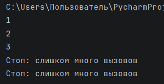

# Отчет по лабораторной работе №5

---

## Задание (Rare). Вариант 4

1.  Реализовать замыкание.
2.  Написать декоратор.
3.  Применить декоратор к замыканию.
4.  Оформить отчёт в README.md.

---

# Условия задач

## Задача №1 (Замыкание)

Замыкание, отбирающее только уникальные значения из переданных.

## Задача №2 (Декоратор)

Декоратор, который будет ограничивать количество вызовов функций.

---

# Описание проделанной работы

В ходе выполнения лабораторной работы было реализовано замыкание `unique_values`, которое сохраняет уже встреченные значения и возвращает только уникальные элементы.

Также был разработан декоратор `limit_calls`, ограничивающий количество вызовов функции.

Декоратор был применён к функции `inner`, находящейся внутри замыкания.

### Код решения:

``` python
# Декоратор, ограничивающий количество вызовов функции
def limit_calls(max_calls):
    def decorator(func):
        count = 0  # счётчик вызовов функции

        def wrapper(value):
            nonlocal count  # используем переменную count из внешней области
            # Проверяем, превышен ли лимит вызовов
            if count >= max_calls:
                print("Стоп: слишком много вызовов")
                return None
            count += 1  # увеличиваем счётчик
            return func(value)  # вызываем исходную функцию

        return wrapper  # возвращаем обёрнутую функцию

    return decorator  # возвращаем декоратор


# Замыкание для получения уникальных значений
def unique_values():
    seen = []  # список для хранения уже встреченных значений

    @limit_calls(5)  # применяем декоратор к внутренней функции
    def inner(value):
        # Проверяем, встречалось ли значение ранее
        if value not in seen:
            seen.append(value)  # сохраняем новое значение
            return value        # возвращаем его

        return None  # если значение уже было — возвращаем None
    return inner  # возвращаем функцию (замыкание)


# Проверка работы программы
f = unique_values()  # получаем функцию для проверки уникальности

data = [1, 2, 2, 3, 1, 4, 5]  # исходные данные

# Проходим по всем элементам списка
for x in data:
    result = f(x)  # обрабатываем элемент

    # Если значение уникальное — выводим
    if result is not None:
        print(result)
```

---

# Скриншоты результатов



---

# Список использованных источников:

1. [Лабораторная работа №5](https://evil-teacher.orbiter.website/prog_pm/lab05/).
2. [Python Docs — Defining Functions](https://docs.python.org/3/tutorial/controlflow.html#defining-functions).
3. [Habr — Декораторы в Python: простое объяснение](https://chatgpt.com/c/69dc6904-d098-8387-926c-e6fd8771c3ad).