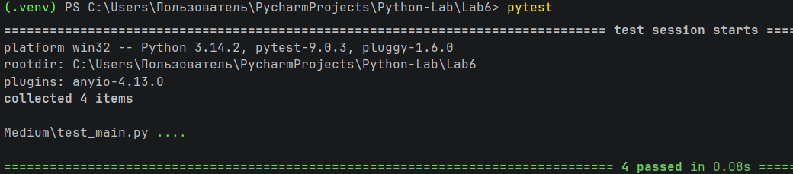

# Отчет по лабораторной работе №6

---

## Задание (Medium). Вариант 4

1. Реализовать генератор, создающий все возможные уникальные комбинации элементов из нескольких последовательностей.
2. Написать тесты для генератора с использованием `pytest`.
3. Оформить отчёт в `README.md`.

---

# Условия задачи

Необходимо реализовать генератор, который формирует все возможные комбинации элементов, выбирая по одному элементу из каждой переданной последовательности.

Пример:
`[1, 2], ['a', 'b'] → (1, 'a'), (1, 'b'), (2, 'a'), (2, 'b')`

---

# Тестирование программы

Для проверки корректности работы генератора были написаны тесты с использованием библиотеки `pytest`.

Тестирование позволяет убедиться в правильности формирования комбинаций для различных наборов входных данных.

---

## Файл с тестами

```python
from main import generate_combinations

# Проверка генератора
# для двух последовательностей
def test_generate_combinations_two_lists():

    data1 = [1, 2]
    data2 = ['a', 'b']

    expected = [
        (1, 'a'),
        (1, 'b'),
        (2, 'a'),
        (2, 'b')
    ]

    result = list(generate_combinations(data1, data2))

    assert result == expected

# Проверка генератора
# для трех последовательностей
def test_generate_combinations_three_lists():

    data1 = [1]
    data2 = ['x', 'y']
    data3 = [True, False]

    expected = [
        (1, 'x', True),
        (1, 'x', False),
        (1, 'y', True),
        (1, 'y', False)
    ]

    result = list(generate_combinations(data1, data2, data3))

    assert result == expected

# Проверка генератора
# с одной последовательностью
def test_generate_combinations_one_list():

    data = [1, 2, 3]

    expected = [
        (1,),
        (2,),
        (3,)
    ]

    assert list(generate_combinations(data)) == expected

# Проверка генератора
# с пустой последовательностью
def test_generate_combinations_empty():

    assert list(generate_combinations([])) == []
```

---

# Скриншоты результатов



---

# Список использованных источников

1. [Лабораторная работа №6](https://evil-teacher.orbiter.website/prog_pm/lab06/).
2. [pytest: helps you write better programs](https://docs.pytest.org/en/stable/).