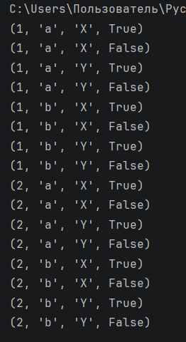

# Отчет по лабораторной работе №6

---

## Задание (Rare). Вариант 4

1. Реализовать генератор, создающий все возможные уникальные комбинации элементов из нескольких последовательностей.
2. Оформить отчёт в README.md.

---

# Условия задачи

Необходимо реализовать генератор, который формирует все возможные комбинации элементов, выбирая по одному элементу из каждой переданной последовательности.

Пример:
`[1, 2], ['a', 'b'] → (1, 'a'), (1, 'b'), (2, 'a'), (2, 'b')`


---

# Описание проделанной работы 

Для решения задачи был использован модуль `itertools`, предоставляющий эффективные инструменты для работы с итераторами.

В частности, применена функция `product`, которая вычисляет декартово произведение переданных последовательностей.

# Реализация генератора

Генератор реализован с использованием ключевого слова `yield`, что позволяет:

- не хранить все комбинации в памяти;
- возвращать значения по мере необходимости;
- работать с потенциально большими наборами данных.

### Код решения:

```python
from itertools import product

def generate_combinations(*sequences):
    # *sequences — позволяет передать любое количество последовательностей
    for combo in product(*sequences):
        # product(*sequences) создаёт все возможные комбинации
        # combo — это кортеж (одна комбинация)
        yield combo  # возвращаем комбинацию по одной (генератор)


# Проверка работы генератора
for c in generate_combinations([1, 2], ['a', 'b'], ['X', 'Y'], [True, False]):
    print(c)  # вывод каждой комбинации
```

---

# Скриншоты результатов



---

# Список использованных источников:

1. [Лабораторная работа №6](https://evil-teacher.orbiter.website/prog_pm/lab06/).
2. [itertools — Functions creating iterators for efficient looping](https://docs.python.org/3/library/itertools.html).
3. [Генераторы в Python](https://habr.com/ru/articles/866616/).