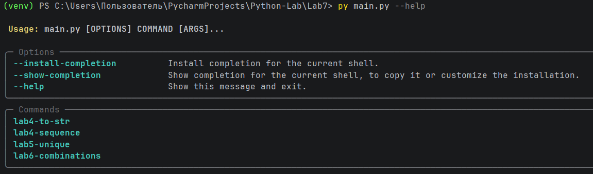
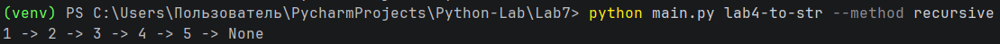
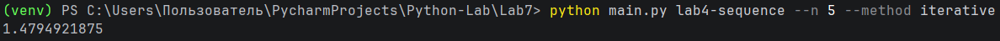
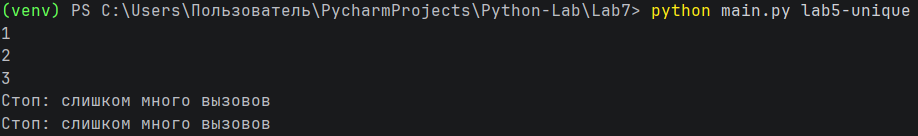
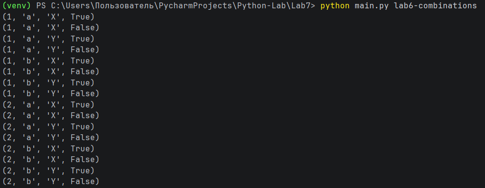

# Отчет по лабораторной работе №7

---

## Задание (Rare)

1. Создать пакет, содержащий 3 модуля на основе лабораторных работ № 4-6.
2. Написать запускающий модуль на основе Typer, который позволит выбирать и настраивать параметры запуска логики из пакета.
3. Оформить отчёт в README.md.

---

# Условия задач

## Лабораторная работа №4

Реализовать функции:

1. Функция для преобразования вложенных списков в строку:
```
>>> to_str([1, [2, [3, [4, [5]]]]])
'1 -> 2 -> 3 -> 4 -> 5 -> None'
```
2. Функция для расчёта $a_i = a_{i-2} + \frac{a_{i-1}}{2^{i-1}} \cdot a_0 = a_1 = 1.$

## Лабораторная работа №5

Реализовать:

1. Замыкание, отбирающее только уникальные значения. 
2. Декоратор, ограничивающий количество вызовов функции.  
3. Применение декоратора к замыканию.

## Лабораторная работа №6

Реализовать генератор, создающий все возможные комбинации элементов из нескольких последовательностей.

---

# Описание проделанной работы

В ходе выполнения лабораторной работы был создан пакет `lab_package`, содержащий три модуля:

- `lab4.py` — функции для работы с рекурсией и последовательностями.  
- `lab5.py` — реализация замыкания и декоратора.  
- `lab6.py` — генератор комбинаций.  

Каждый модуль содержит решения соответствующей лабораторной работы.

Также был реализован запускающий модуль `main.py` с использованием библиотеки Typer, позволяющий:

- выбирать нужную задачу через команду.  
- задавать параметры запуска (например, метод решения или значение `n`).  
- выводить результат работы программы в консоль.  

---

# Структура проекта

```text
Lab7/
├── lab_package/
│   ├── __init__.py
│   ├── lab4.py
│   ├── lab5.py
│   └── lab6.py
├── main.py
└── README.md
```


---

# Примеры запуска

Перед запуском необходимо установить библиотеку Typer:

```bash
pip install typer
```

## Просмотр доступных команд

```bash
python main.py --help
```

Выводит список всех доступных команд и их параметров:



## Лабораторная работа №4

1. Преобразование вложенного списка в строку (рекурсивно)

```bash
python main.py lab4-to-str --method recursive
```

Результат:



2. Вычисление последовательности (итеративно)

```bash
python main.py lab4-sequence --n 5 --method iterative
```

Результат:



## Лабораторная работа №5

Отбор уникальных значений с ограничением вызовов:

```bash
python main.py lab5-unique
```

Результат:



## Лабораторная работа №6

Генерация всех комбинаций:

```bash
python main.py lab6-combinations
```

Результат:



---

# Список использованных источников:

1. [Лабораторная работа №4](https://evil-teacher.orbiter.website/prog_pm/lab04/).
2. [Лабораторная работа №5](https://evil-teacher.orbiter.website/prog_pm/lab05/).
3. [Лабораторная работа №6](https://evil-teacher.orbiter.website/prog_pm/lab06/).
4. [Typer](https://typer.tiangolo.com/?utm_source=chatgpt.com#run-the-upgraded-example).