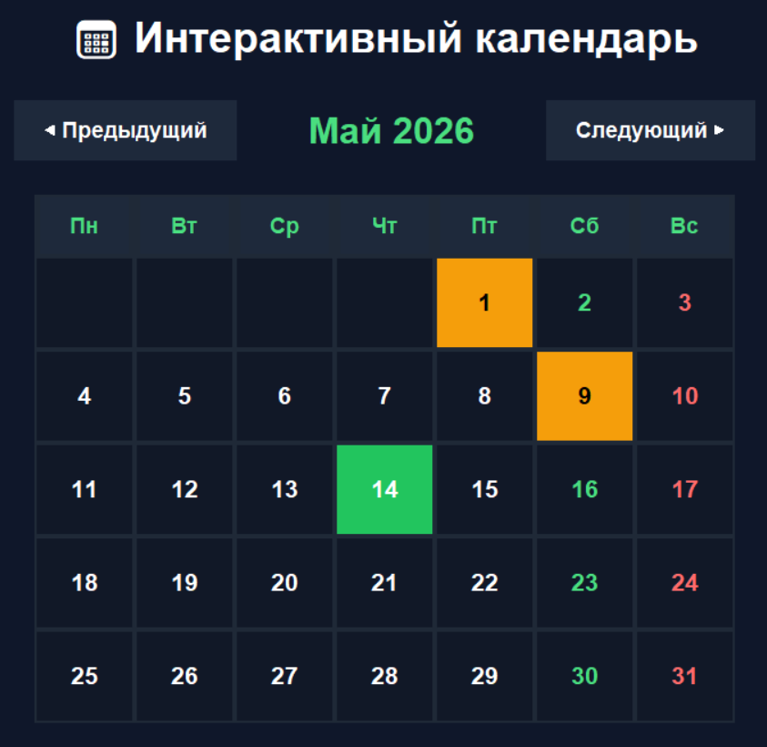
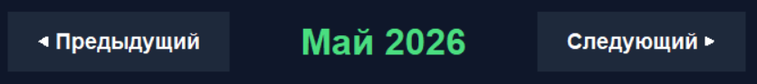
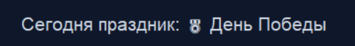

# Отчет по лабораторной работе №8

---

## Задание (Rare)

1. Реализовать приложение с GUI по своему варианту.
2. Оформить отчёт в `README.md`.

Вариант: Интерактивный календарь

---

# Описание проделанной работы

В ходе выполнения лабораторной работы было разработано GUI-приложение
«Интерактивный календарь» с использованием библиотеки `Tkinter`.

Приложение позволяет:

- просматривать календарь по месяцам;
- переключаться между месяцами;
- возвращаться к текущему месяцу;
- подсвечивать выходные дни;
- отображать праздничные даты;
- выводить информацию о праздниках при нажатии на дату.

Для создания календаря использовались встроенные модули Python:

- `tkinter` — создание графического интерфейса;
- `calendar` — генерация календаря;
- `datetime` — работа с текущей датой.

---

# Основные возможности программы

## Переключение между месяцами

Пользователь может переключать месяцы при помощи кнопок:

```
◀ Предыдущий
Следующий ▶
```

## Подсветка текущего дня

Текущая дата автоматически выделяется зелёным цветом для удобства пользователя.

## Выделение выходных дней

- суббота отображается зелёным цветом;
- воскресенье отображается красным цветом.
Праздничные даты


## Праздничные даты

В календаре реализована подсветка государственных праздников:

- 🎄 Новый год
- 🛡 День защитника Отечества
- 🌸 Международный женский день
- 🌷 Праздник Весны и Труда
- 🎖 День Победы
- 🇷🇺 День России
- ✨ День народного единства

При нажатии на праздничную дату появляется информация о празднике.

---

# Код решения:

```python
import tkinter as tk
import calendar
from datetime import datetime

# Цвета интерфейса
BG_COLOR = "#0f172a"
CARD_COLOR = "#1e293b"
GREEN = "#4ade80"
RED = "#ff6b6b"
WHITE = "white"
HOLIDAY = "#f59e0b"

# Названия месяцев
months = [
    "Январь", "Февраль", "Март",
    "Апрель", "Май", "Июнь",
    "Июль", "Август", "Сентябрь",
    "Октябрь", "Ноябрь", "Декабрь"
]

# Дни недели
days = ["Пн", "Вт", "Ср", "Чт", "Пт", "Сб", "Вс"]

# Праздники
holidays = {
    (1, 1): "🎄 Новый год",
    (2, 23): "🛡 День защитника Отечества",
    (3, 8): "🌸 Международный женский день",
    (5, 1): "🌷 Праздник Весны и Труда",
    (5, 9): "🎖 День Победы",
    (6, 12): "🇷🇺 День России",
    (11, 4): "✨ День народного единства"
}

# Текущая дата
now = datetime.now()
current_month = now.month
current_year = now.year

# Функция рисования календаря
def draw_calendar():
    global current_month, current_year

    # Удаляем старый календарь
    for widget in calendar_frame.winfo_children():
        widget.destroy()

    # Показываем месяц и год
    title_label.config(
        text=f"{months[current_month - 1]} {current_year}"
    )

    # Создаем дни недели
    for col, day in enumerate(days):
        label = tk.Label(
            calendar_frame,
            text=day,
            font=("Arial", 14, "bold"),
            bg=CARD_COLOR,
            fg=GREEN,
            width=6,
            height=2
        )

        label.grid(row=0, column=col, padx=2, pady=2)

    # Получаем календарь месяца
    cal = calendar.monthcalendar(
        current_year,
        current_month
    )

    today = datetime.now()

    # Создаем дни месяца
    for row_num, week in enumerate(cal, start=1):
        for col_num, day in enumerate(week):

            # Пустые клетки
            if day == 0:
                text = ""
            else:
                text = str(day)

            bg_color = "#111827"
            fg_color = WHITE

            # Суббота
            if col_num == 5:
                fg_color = GREEN

            # Воскресенье
            if col_num == 6:
                fg_color = RED

            # Праздники
            if (current_month, day) in holidays:
                bg_color = HOLIDAY
                fg_color = "black"

            # Сегодняшний день
            if (
                day == today.day and
                current_month == today.month and
                current_year == today.year
            ):
                bg_color = "#22c55e"
                fg_color = "white"

            # Ячейка дня
            label = tk.Label(
                calendar_frame,
                text=text,
                font=("Arial", 16, "bold"),
                bg=bg_color,
                fg=fg_color,
                width=6,
                height=3,
                relief="flat",
                cursor="hand2"
            )

            label.grid(
                row=row_num,
                column=col_num,
                padx=2,
                pady=2
            )

            # Наведение мыши
            label.bind(
                "<Enter>",
                lambda e, l=label: l.config(bg="#334155")
            )

            # Возвращаем цвет после наведения
            label.bind(
                "<Leave>",
                lambda e, l=label, d=day: reset_color(l, d)
            )

            # Если праздник — показываем информацию
            if (current_month, day) in holidays:
                holiday_name = holidays[(current_month, day)]

                label.bind(
                    "<Button-1>",
                    lambda e, h=holiday_name:
                    show_holiday(h)
                )

# Возврат цвета клетки
def reset_color(label, day):

    # Если праздник
    if (current_month, day) in holidays:
        label.config(bg=HOLIDAY)
        return

    today = datetime.now()

    # Если сегодняшний день
    if (
        day == today.day and
        current_month == today.month and
        current_year == today.year
    ):
        label.config(bg="#22c55e")

    else:
        label.config(bg="#111827")

# Показ информации о празднике
def show_holiday(name):
    holiday_label.config(
        text=f"Сегодня праздник: {name}"
    )

# Следующий месяц
def next_month():
    global current_month, current_year

    current_month += 1

    if current_month > 12:
        current_month = 1
        current_year += 1

    draw_calendar()

# Предыдущий месяц
def prev_month():
    global current_month, current_year

    current_month -= 1

    if current_month < 1:
        current_month = 12
        current_year -= 1

    draw_calendar()

# Переход к текущему месяцу
def today_month():
    global current_month, current_year

    now = datetime.now()

    current_month = now.month
    current_year = now.year

    draw_calendar()

# Создаем окно
root = tk.Tk()

root.title("Интерактивный календарь")
root.geometry("1000x760")
root.config(bg=BG_COLOR)

# Заголовок
header = tk.Label(
    root,
    text="📅 Интерактивный календарь",
    font=("Arial", 28, "bold"),
    bg=BG_COLOR,
    fg="white"
)

header.pack(pady=20)

# Верхняя панель
top_frame = tk.Frame(
    root,
    bg=BG_COLOR
)

top_frame.pack(pady=10)

# Кнопка назад
prev_button = tk.Button(
    top_frame,
    text="◀ Предыдущий",
    command=prev_month,
    font=("Arial", 14, "bold"),
    bg=CARD_COLOR,
    fg="white",
    bd=0,
    padx=20,
    pady=10,
    cursor="hand2"
)

prev_button.grid(row=0, column=0, padx=20)

# Текущий месяц
title_label = tk.Label(
    top_frame,
    text="",
    font=("Arial", 24, "bold"),
    bg=BG_COLOR,
    fg=GREEN
)

title_label.grid(row=0, column=1, padx=40)

# Кнопка вперед
next_button = tk.Button(
    top_frame,
    text="Следующий ▶",
    command=next_month,
    font=("Arial", 14, "bold"),
    bg=CARD_COLOR,
    fg="white",
    bd=0,
    padx=20,
    pady=10,
    cursor="hand2"
)

next_button.grid(row=0, column=2, padx=20)

# Фрейм календаря
calendar_frame = tk.Frame(
    root,
    bg="#1f2937"
)

calendar_frame.pack(
    padx=20,
    pady=20
)

# Нижняя панель
bottom_frame = tk.Frame(
    root,
    bg=BG_COLOR
)

bottom_frame.pack(pady=10)

# Кнопка "Сегодня"
today_button = tk.Button(
    bottom_frame,
    text="📍 Сегодня",
    command=today_month,
    font=("Arial", 14, "bold"),
    bg=CARD_COLOR,
    fg=GREEN,
    bd=0,
    padx=20,
    pady=10,
    cursor="hand2"
)

today_button.grid(row=0, column=0, padx=10)

# Информация о празднике
holiday_label = tk.Label(
    root,
    text="Нажмите на праздничную дату",
    font=("Arial", 16),
    bg=BG_COLOR,
    fg="#cbd5e1"
)

holiday_label.pack(pady=20)

# Запуск календаря
draw_calendar()

# Запуск приложения
root.mainloop()
```

---

# Скриншоты результатов

Главное окно приложения



Переключение между месяцами



Отображение праздничных дат



---

# Список использованных источников:

1. [tkinter — Python interface to Tcl/Tk](https://docs.python.org/3/library/tkinter.html).
2. [calendar — General calendar-related functions](https://docs.python.org/3/library/calendar.html).
3. [datetime — Basic date and time types](https://docs.python.org/3/library/datetime.html).